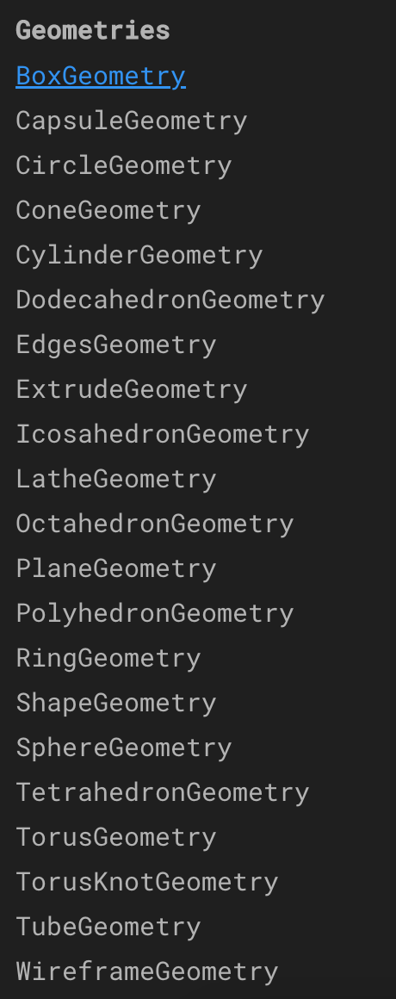
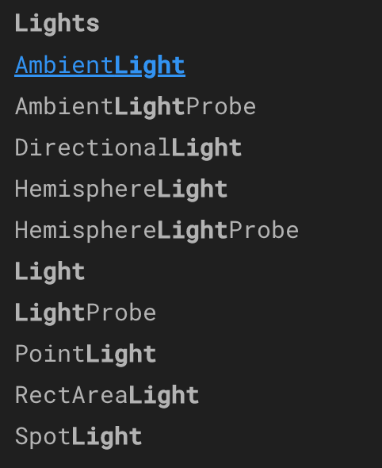
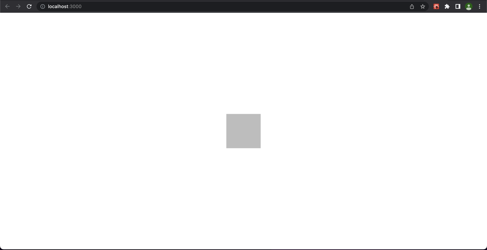

# How we got here:

We created a react application.
```bash
yarn create react-app r3ftechtalk
```
Then we added our dependencies 'three' & '@react-three/fiber'
```bash
yarn add three @react-three/fiber @react-three/drei
```
Dependencies for React Three Fiber:

To use React Three Fiber components have to be functional based. This is because of a dependency on hooks.

three - three.js is javascript library that utilized your processor to render 3d graphics using WebGL. WebGL is a javascript API that is used to render 3d web graphics.

Documentation:

https://threejs.org/docs/index.html#manual/en/introduction/Creating-a-scene

@react-three/fibder - is a react library that expresses three.js as JSX.

Documentation:

https://docs.pmnd.rs/react-three-fiber/getting-started/introduction#is-it-slower-than-plain-three.js?

## Ok so now what?

We need to set up a 'scene', 'camera', and 'light' to be able to have 3d objects display and render in our browser.

Reacr Three Fiber has all of these bundled into one convenient component called 'Canvas'. You can manually control these later if you need more control of your scene/lighting/cameras.

The canvas component directly relates to its parent. We can control the size of the canvas by setting the size of its parent - or if you want it to fill the screen we attach it to root.

Once we have the Canvas set up we still need to declare lighting, and a 3d object. 

## Objects: 
Here is the basic setup for a cube:

 ```JSX 
 <mesh>
    <boxGeometry />
    <meshStandardMaterial />
</mesh>
```
You will notice that ```<mesh> </mesh>``` contains box geometry and a mesh standard material. This is because we have to load a material into our 3d object. (like a texture or a color)

Here is a list of some 3d objects that can be declared in r3f (everything contained in the three.js documentation Geometry section can be declared) Do not forget to check out the properties for each constructor to see if any are required:



Cube: https://threejs.org/docs/#api/en/geometries/BoxGeometry translated to react-three/fiber: 
 ```JSX 
 <mesh>
    <boxGeometry />
    <meshStandardMaterial />
</mesh>
```
Sphere: https://threejs.org/docs/#api/en/geometries/SphereGeometry translated into react-three/fiber:
```JSX
 <mesh>
    <sphereGeometry />
    <meshStandardMaterial />
</mesh>
```
Cylindrical: https://threejs.org/docs/#api/en/geometries/CylinderGeometry translated into react-three/fiber:
```JSX
 <mesh>
    <cylinderGeometry />
    <meshStandardMaterial />
</mesh>
```
Dodecahedron: https://threejs.org/docs/#api/en/geometries/DodecahedronGeometry translated into react-three/fiber:
```JSX
 <mesh>
    <dodecahedronGeometry />
    <meshStandardMaterial />
</mesh>
```
## Lighting:

Ambient light sets the lighting for the entire scene. Here is the documentation: https://threejs.org/docs/#api/en/lights/AmbientLight



Here is the declaration:
```JSX
<ambientLight />
```
ambient light has properties of: color, and intensity. (Both are optional)

Here is an example of setting intensity:

```JSX
<ambientLight intensity={.5} />
```

There are more Lights outlined in the documentation under the Lights section. https://threejs.org/docs/?q=light#api/en/lights/Light

## Put it all together:

In our App.js lets create our canvas component, and create our lighting and mesh components. 

It should look something like this:

```JSX
import React from 'react'
import './App.css'
import { Canvas } from '@react-three/fiber'

export default function App() {
  return (
    <div className='CanvasContainer'>
        <Canvas>
            <ambientLight intensity={.5}/>
            <mesh>
                <boxGeometry />
                <meshStandardMaterial />
            </mesh>
        </Canvas>
    </div>
  )
}
```
And in our CSS:
```CSS
.CanvasContainer{
    height:100vh;
    width:100vw;
}
```
# Awesome!!... but wait?

If done correctly your react application should look something like this:



But the problem is it looks 2d right? We need to add camera controls so we can rotate around it!

To assist in this task we will install a helper from the react ecosystem:

Remember the react-three/drei import at the top? Now we will use it.

Here is the documentation: https://github.com/pmndrs/drei

we will be using [orbit controls](https://github.com/pmndrs/drei#controls)

here is how to declare them:

```JSX
//import the dependency:
import {OrbitControls} from '@react-three/drei'

//inside of our canvas:
<OrbitControls/>
```
Now you should be able to zoom in, out, rotate the camera, pan the camera (using right mouse click)

You could also limit the controls by the user by defining props for orbit controls.
Here are some examples:

```JSX
 <OrbitControls 
    makeDefault={boolean}
    enabled={boolean}
    minAzimuthAngle={number}
    maxAzimuthAngle={number}
    minPolarAngle={number}
    maxPolarAngle={number}
    enableZoom={boolean}
    enablePan={boolean}
    zoomSpeed={number}
    minDistance={number}
    maxDistance={number}
    />
```

## I can rotate, but there is no color or shading?

The next steps will be to add another light so we can have some shadows on the sides of our object. If we want shadows to project from our object to the 'ground' we will have to create a ground object as well. Lets create a directional light.

Directional Light documentation: https://threejs.org/docs/index.html?q=direction#api/en/lights/DirectionalLight

A directional light is a light source that only has one direction, and covers the entirity of your scene. Think of it acting as the 'sun'.

how to declare it in react-three/fiber:

```JSX
<directionalLight/>
```

Here are some of the properties of directionalLights:
```JSX
<directionalLight 
    intensity={number} 
    position={[0,10,0]} //an array of 3 numbers representing x, z, y coordinates in our scene
    color={'string'} //can be basic red, blue, or hex color
    shadow-bias={-.001} //number - but leave it here
    shadow-mapSize={[1024,1024]} //two numbers 
    castShadow={boolean}/>//default is true.
/>
```

Next lets declare a plane inside of the canvas:

```JSX
<mesh 
    rotation={[-Math.PI/2, 0, 0]} //this rotates the plane 
    position={[0,-.5,0]} //this sets the position of the plane
>
    <planeBufferGeometry 
        attach={'geometry'}
        args={[25,25]} //this property sets the size of the plane (height & width)
    />
    <meshPhongMaterial //this is a different type of material.
        attach={'material'} //this property allows the color to be set to the plane
        color='white' //this property defines the color of the plane
    />
</mesh>
```

Now to see shadows, we have to pass the property 'shadows' to our Canvas.

```JSX
<Canvas shadows> //shadows is a boolean with a default value of true. Once the property is set, you can define what casts & recieves shadows.
</Canvas>
```

Then we need to give our objects the ability to cast / recieve shadows.
We use the castShadow/receiveShadow property to cast and or recieve shadows like below:
```JSX
<directionalLight 
    position={[0,10,0]} //position of directional light
    intensity={1} //intensity of the light
    castShadow //boolean to cast shadows
    shadow-mapSize={[1024,1024]} //you can define the shadowmap. higher numbers means smoother shadows but less performance.
/>
<mesh 
    castShadow //boolean to allow this cube to cast shadows. you can also allow it to receive shadows.
    position={[0,1,0]}>
    <boxGeometry />
    <meshStandardMaterial attach={'material'} color='red'/>
</mesh>

<mesh 
    rotation={[-Math.PI/2, 0, 0]} //define the rotation of the plane.
    position={[0,-.5,0]} 
    receiveShadow //allow it to receive the shadows being cast.
>
    <planeBufferGeometry attach={'geometry'} args={[25,25]}  />
    <meshPhongMaterial attach={'material'} color='white'/>
</mesh>

```
Our final result will look like below:

```JSX

import React from 'react'
import './App.css'
import { Canvas } from '@react-three/fiber'
import { OrbitControls } from '@react-three/drei'

export default function App() {
  return (
    <div className='CanvasContainer'>
      <Canvas shadows>
        <directionalLight position={[0,10,0]} intensity={1} castShadow shadow-mapSize={[1024,1024]}/>

        <ambientLight intensity={.5}/>

        <mesh castShadow position={[0,1,0]}>
          <boxGeometry />
          <meshStandardMaterial attach={'material'} color='red'/>
        </mesh>

        <mesh rotation={[-Math.PI/2, 0, 0]} position={[0,-.5,0]} receiveShadow>
          <planeBufferGeometry attach={'geometry'} args={[25,25]}  />
          <meshPhongMaterial attach={'material'} color='white'/>
        </mesh>

        <OrbitControls/>

      </Canvas>
    </div>
  )
}

```

